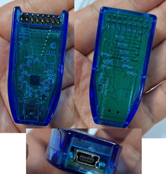
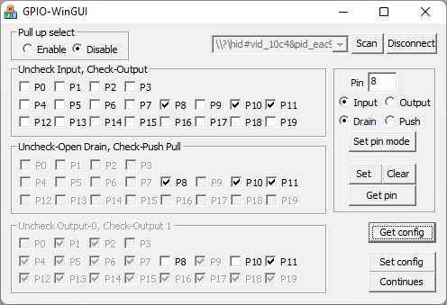
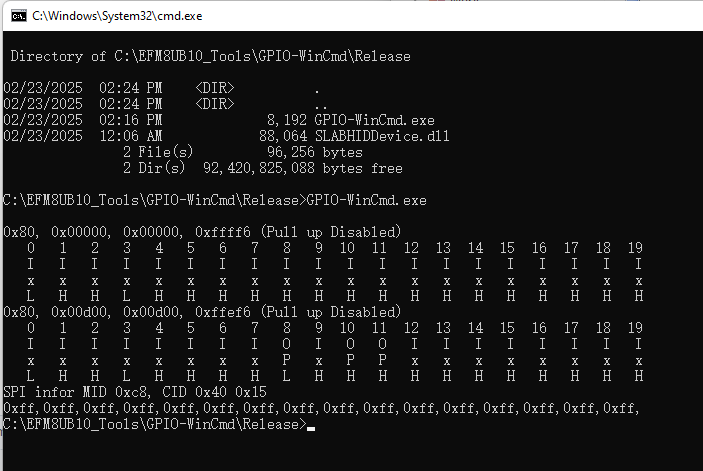

USBHID GPIO extender.

Demo screen captures.

This test is just an example of showing how to control Pins in Window programs. It's a start point of using USBHID GPIO extender. A Windows GUI is easy to evaluate this tool quickly. Please enjoy it and modify it freely as you want.
1. The hardware can be ordered from www.taobao.com.
2. The .sls file can be imported to Simplicity Studio to compile or debug. A free Keil C51 license can be ordered from Simplicity Studio. Simplicity Studio can be downloaded from www.silabs.com. (Source code is uploaded too for easy to view.)
3. It can be changed freely if want.
4. It can be upgraded. You can use Silicon Labs AN945 tool upgrade.
5. If bootloader was damaged, need use C2 interface re-program. A hardware debugger will be used, like Silicon Labs Toolstick, UDA-8(UDA-32) or J-Link from www.segger.com. Those debugger can be used to debug EFM8UB10 software too.
6. Anything need help, you can mail to gr_li@163.com, or guanrong.li@silabs.com if it's reachable which means I'm still working in Silicon Labs. (^_^)
7. Uploaded Date: 2025-02-23

